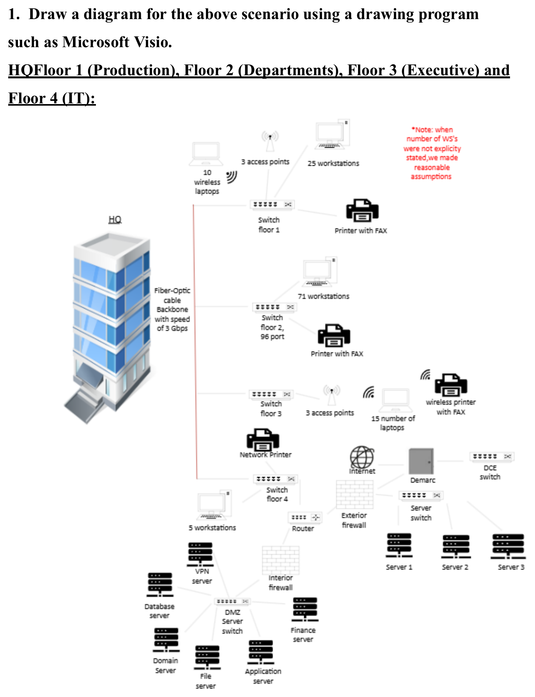
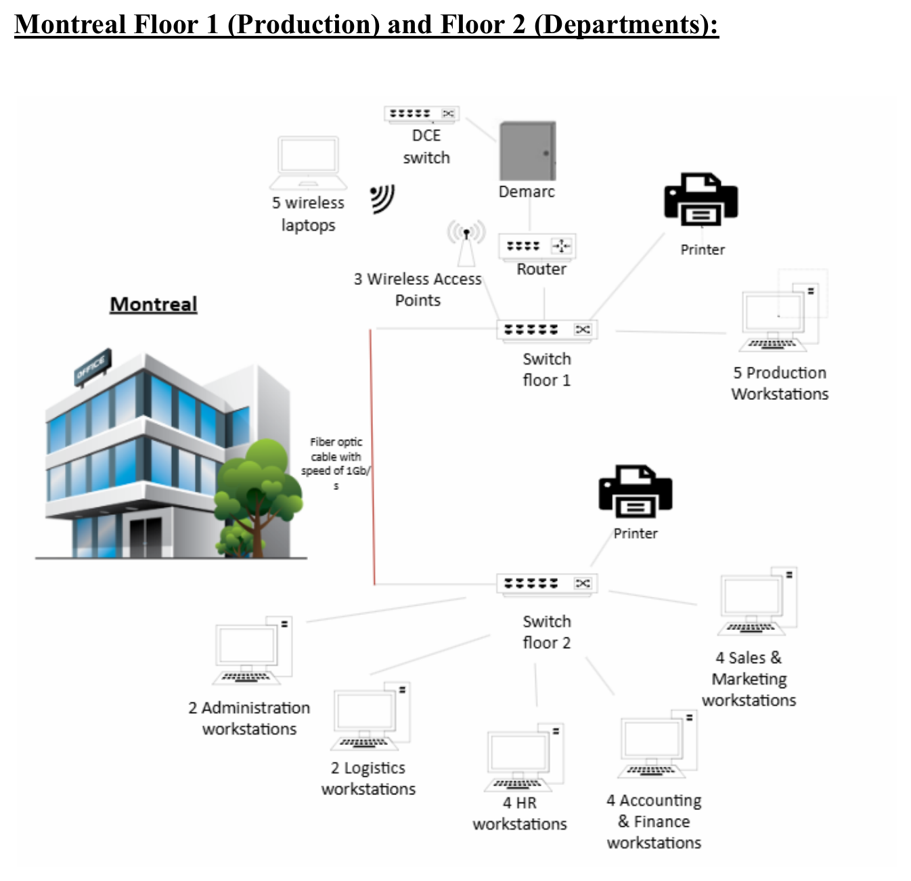
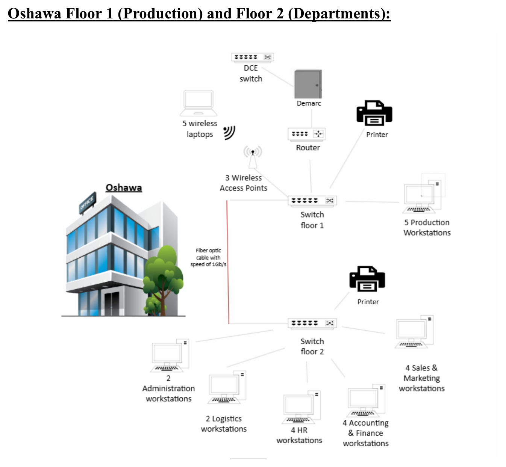
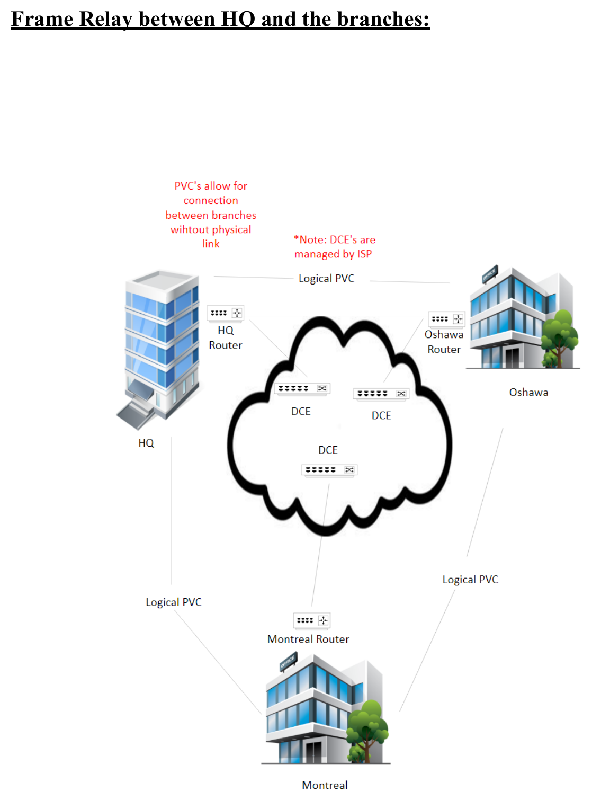
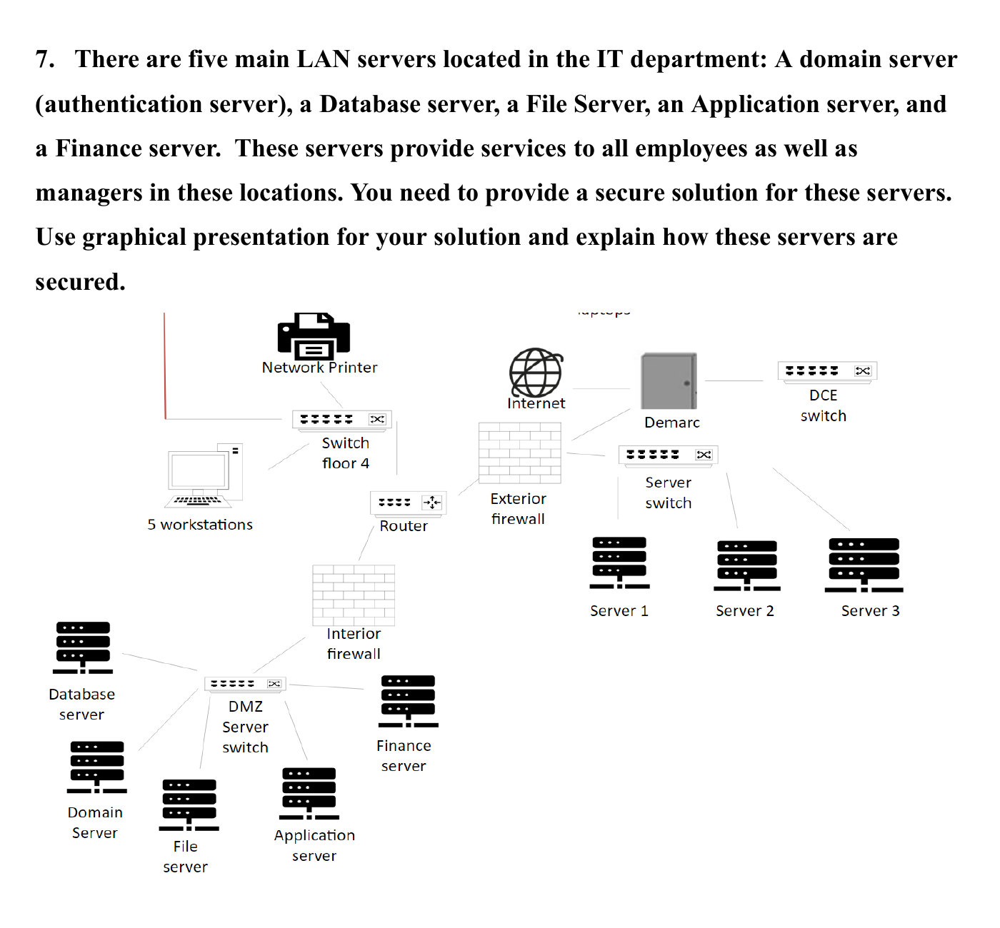

# Hegelberg Dairy Inc. — IT Infrastructure Design

A complete network infrastructure design for **Hegelberg Dairy Inc.**, covering the Headquarters (HQ) and two branch offices (Montreal and Oshawa). This project spans LAN/WAN design, IP addressing, VoIP, remote connectivity, and server security.

## Table of Contents
- [Overview](#overview)
- [Network Diagrams](#network-diagrams)
- [1. LAN Solutions Per Location](#1-lan-solutions-per-location)
- [2. IP Addressing (DHCP/DNS)](#2-ip-addressing-dhcpdns)
- [3. Remote Connectivity (IPsec VPN)](#3-remote-connectivity-ipsec-vpn)
- [4. VoIP Solution](#4-voip-solution)
- [5. Web & Email Services (DMZ)](#5-web--email-services-dmz)
- [6. LAN Server Security](#6-lan-server-security)

## Overview

Hegelberg Dairy Inc. operates three sites:

| Site | Floors | Function |
|---|---|---|
| **HQ** | 4 | Production, Departments, Executive, IT |
| **Montreal** | 2 | Production, Departments |
| **Oshawa** | 2 | Production, Departments |

All sites are interconnected via a **Frame Relay WAN** using Permanent Virtual Circuits (PVCs), with fiber-optic backbones inside each building (3 Gbps at HQ, 1 Gbps at Montreal/Oshawa).

## Network Diagrams

### HQ — Floors 1–4 (Production, Departments, Executive, IT)

### Montreal — Floor 1 (Production) & Floor 2 (Departments)

### Oshawa — Floor 1 (Production) & Floor 2 (Departments)

### Frame Relay Between HQ and the Branches

### DMZ & LAN Server Security

## 1. LAN Solutions Per Location

### HQ Floor 1 — Production
- 25 workstations, 10 wireless laptops, 3 WAPs (802.11g), 1 printer/FAX
- All wired nodes connect to a **48-port managed switch** via CAT 5e/6 (RJ-45)
- Wireless laptops connect through WAPs to the same switch
- Switch links to the fiber backbone (3 Gbps) via an **SFP transceiver** (converts electrical ↔ optical signal, RJ-45 ↔ LC connector)

### HQ Floor 2 — Departments
- 71 workstations (Sales & Marketing, Accounting & Finance, HR, Logistics) + 1 printer/FAX
- **96-port managed switch**, CAT 6e/RJ-45
- **Subnetting** separates each department into its own logical network for security
- Connects to backbone via CAT 6e + SFP

### HQ Floor 3 — Executive
- 15 wireless laptops, 3 WAPs, 1 wireless printer/FAX
- **24-port managed switch** (higher security tier for executives)
- WAPs use 802.11g (2.4 GHz, 54 Mbps)
- Connects to backbone via CAT 6e + SFP

### HQ Floor 4 — IT
- 5 workstations, network printer, router, server switch, DMZ switch, Servers 1–3, VPN/Database/File/Application/Finance servers, internal & external firewalls
- Router connects to server switch, DMZ switch, and the **demarc** (via media converter)
- **External firewall** filters inbound traffic before the router
- Server switch → Servers 1–3 via **shielded CAT 7** (EMI protection)
- DMZ switch → Finance/Application/VPN/File/Database servers via shielded CAT 7
- Demarc links to Montreal/Oshawa demarcs via Frame Relay (ISP-managed DCE)

### Montreal & Oshawa Floor 1 — Production
- 5 workstations, 5 wireless laptops, 3 WAPs, 1 printer, 1 router
- **Smart-managed 24-port switch**, CAT 5e/RJ-45
- Connects to the 1 Gbps fiber backbone via CAT 6 + SFP (LC conversion)

### Montreal & Oshawa Floor 2 — Departments
- Sales & Marketing, Accounting & Finance, HR, Logistics, Administration workstations + 1 printer
- **Self-managed 24-port switch**, CAT 5e/RJ-45
- **Subnetting** isolates each department
- Connects to Floor 1 via SFP over the fiber backbone

**Key connectivity devices used throughout:** managed switches, WAPs, SFP transceivers, fiber media converters, routers, and firewalls.

## 2. IP Addressing (DHCP/DNS)

Each site runs its own **DHCP server**, automatically assigning IP address, subnet mask, default gateway, and DNS server to clients (average lease time: 5s in this design). DHCP updates the **DNS server** with hostname-to-IP mappings so devices can be reached by name instead of IP.

| Location | Subnet Mask |
|---|---|
| HQ | 255.255.255.0 |
| Montreal | 255.255.255.0 |
| Oshawa | 255.255.255.0 |

### HQ
| Floor / Dept | Subnet | IP Range |
|---|---|---|
| Floor 1 (Production, 40 hosts) | 10.1.1.0/24 | 10.1.1.10 – 10.1.1.110 |
| Floor 2 (73 hosts) | 10.1.2.0/24 | — |
| — Sales & Marketing | | 10.1.2.10 – 10.1.2.29 |
| — Accounting & Finance | | 10.1.2.30 – 10.1.2.49 |
| — HR | | 10.1.2.50 – 10.1.2.70 |
| — Logistics | | 10.1.2.60 – 10.1.2.91 |
| Floor 3 (Executive) | 10.1.3.0/24 | 10.1.3.10 – 10.1.3.17 |
| Floor 4 (IT, 20 hosts) | 10.1.4.0/24 | 10.1.4.10 – 10.1.4.39 |

### Montreal
| Floor / Dept | Subnet | IP Range |
|---|---|---|
| Floor 1 (Production, 15 hosts) | 10.3.1.0/24 | 10.3.1.10 – 10.3.1.49 |
| Floor 2 (15 hosts) | 10.3.2.0/24 | — |
| — Sales & Marketing | | 10.3.2.10 – 10.3.2.17 |
| — Accounting & Finance | | 10.3.2.18 – 10.3.2.27 |
| — HR | | 10.3.2.28 – 10.3.2.31 |
| — Logistics | | 10.3.2.32 – 10.3.2.36 |
| — Administration | | 10.3.2.37 – 10.3.2.41 |

### Oshawa
| Floor / Dept | Subnet | IP Range |
|---|---|---|
| Floor 1 (Production, 15 hosts) | 10.2.1.0/24 | 10.2.1.10 – 10.2.1.49 |
| Floor 2 (20 hosts) | 10.2.2.0/24 | — |
| — Sales & Marketing | | 10.2.2.10 – 10.2.2.17 |
| — Accounting & Finance | | 10.2.2.18 – 10.2.2.27 |
| — HR | | 10.2.2.28 – 10.2.2.31 |
| — Logistics | | 10.2.2.32 – 10.2.2.36 |
| — Administration | | 10.2.2.37 – 10.2.2.41 |

## 3. Remote Connectivity (IPsec VPN)

HQ, Montreal, Oshawa, and XYZ-Bank connect over an **IPsec-based VPN**, acting as an encrypted tunnel for sensitive traffic (e.g., financial data).

- **Tunnel Mode** — encrypts entire packets; used for site-to-site links
- **Transport Mode** — encrypts payload only
- **IKE (Internet Key Exchange)** — securely negotiates and exchanges encryption keys
- **NAT Traversal** — keeps VPN traffic working through firewalls/NAT
- **RBAC (Role-Based Access Control)** — restricts XYZ-Bank to only the financial systems it needs
- Redundant gateways support scalability and failover

## 4. VoIP Solution

VoIP runs over the existing **Frame Relay** WAN using **PVCs** between HQ, Montreal, and Oshawa.

- **HQ**: IP-PBX routes all internal/external calls
- **Montreal / Oshawa**: local call-handling devices linked back to the HQ PBX
- **Transport**: T-1 lines (1.544 Mbps, up to 24 channels)
- **Codec**: G.711 (80 kbps/call) → ~19 simultaneous calls per T-1; 2 lines support ~38 simultaneous calls
- **QoS** prioritizes voice traffic to offset Frame Relay's lack of built-in error handling

## 5. Web & Email Services (DMZ)

Public-facing and shared services sit in a **DMZ** between the external and internal firewalls:

- **Web server** — company site, secured with HTTPS/SSL/TLS
- **Email server** — SMTP (sending), IMAP/POP3 (retrieval)
- **DNS server**
- **VPN server** — gateway for authorized remote users

**Security controls:**
- External firewall screens internet-facing traffic
- Internal firewall limits DMZ → internal network traffic to only what's authorized
- VLANs isolate DMZ traffic
- TLS kept current; VPN adds encryption + authentication for remote access

## 6. LAN Server Security

Five core servers sit behind both the external and an internal firewall:

| Server | Protocol / Control |
|---|---|
| **Domain (Authentication)** | LDAP, internal-only requests |
| **Database** | SQL over SSL/TLS, restricted to specific internal IPs/services |
| **File** | SFTP over encrypted connection, authenticated devices only |
| **Application** | HTTPS, restricted to authorized internal apps/devices |
| **Finance** | SSL/TLS + VPN + RBAC (highest security tier) |

The external firewall blocks unauthorized external access; the internal firewall adds a second layer before traffic reaches the server segment.

---

*Based on the original design document (`it_infra.pdf`) for Hegelberg Dairy Inc.*
